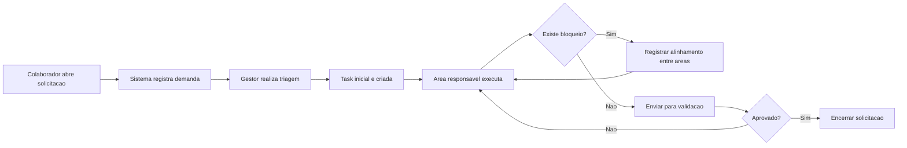
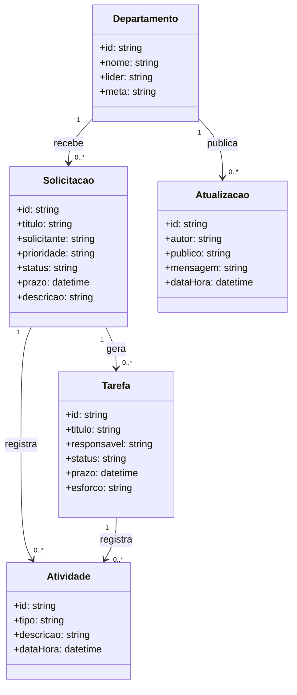
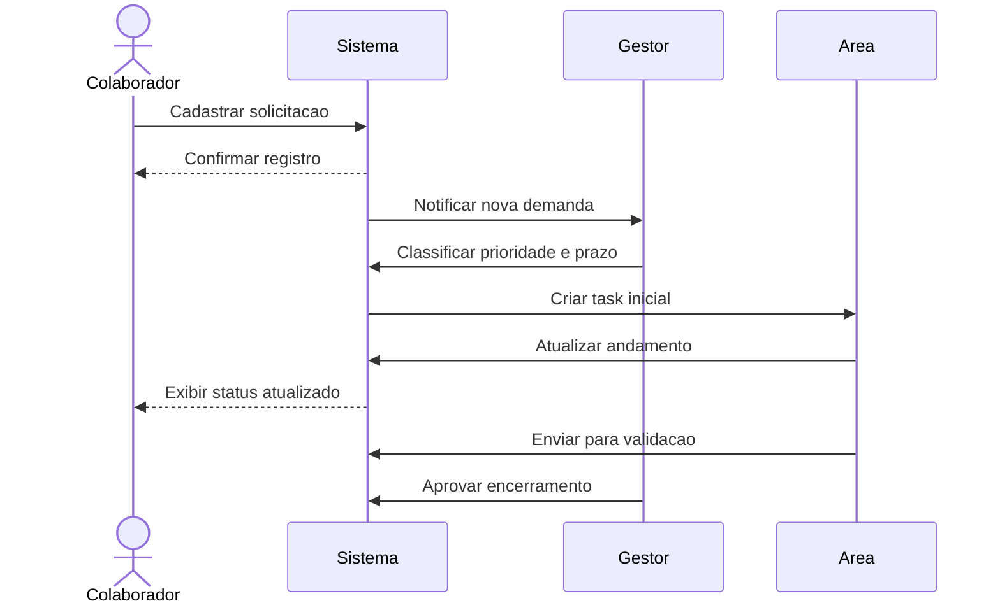
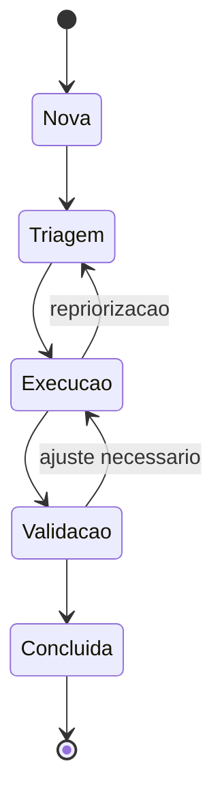

# 04. Modelagem UML

## 4.1 Fluxo principal do processo

## 4.2 Diagrama de classes

## 4.3 Diagrama de sequencia

## 4.4 Diagrama de estados da solicitacao

## 4.5 Interpretacao

- a solicitacao e o objeto central do fluxo
- cada solicitacao pode gerar uma ou mais tarefas
- os departamentos interagem por meio de tarefas e atualizacoes
- a trilha de atividades reforca a rastreabilidade
