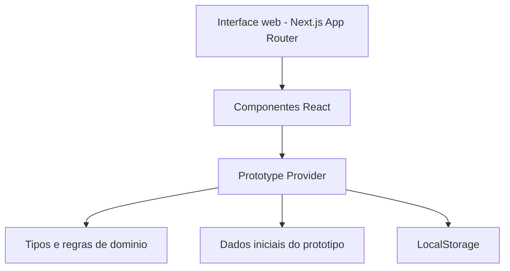

# 07. Arquitetura da Solucao

## Visao geral

O prototipo foi construido com uma arquitetura simples e evolutiva, adequada para MVP academico e preparada para expansao posterior.

## Camadas

### 1. Camada de apresentacao

Responsavel pelas telas e interacoes do usuario.

- `src/app/`
- `src/components/`

Principais responsabilidades:

- navegacao entre modulos
- renderizacao de dashboards e listas
- formularios de cadastro e atualizacao
- feedback visual do estado operacional

### 2. Camada de estado e regras locais

Responsavel por orquestrar o estado do prototipo e as regras do fluxo.

- `src/components/prototype-provider.tsx`

Principais responsabilidades:

- manter dados de solicitacoes, tarefas, atualizacoes e atividades
- criar novas solicitacoes e tasks iniciais
- avancar status de solicitacoes
- mover tasks no quadro
- persistir o estado no `localStorage`

### 3. Camada de dominio simplificado

Responsavel pelos tipos, seeds e funcoes utilitarias.

- `src/lib/types.ts`
- `src/lib/prototype-data.ts`
- `src/lib/formatters.ts`

Principais responsabilidades:

- definir entidades do sistema
- manter dados de exemplo para o prototipo
- formatar datas, SLA e indicadores auxiliares

## Diagrama logico simplificado

## Entidades centrais

- Solicitacao
- Tarefa
- Departamento
- Atualizacao
- Atividade

## Decisoes arquiteturais

### Uso de estado local persistido

Foi adotado `localStorage` para manter o prototipo funcional sem depender de backend real, permitindo demonstracao rapida do fluxo.

### Separacao entre UI e dominio

Os componentes visuais ficam separados dos tipos e dados do dominio para facilitar manutencao e futura migracao para API real.

### App Router

A aplicacao usa App Router do Next.js para manter a estrutura moderna e extensivel do projeto.

## Evolucao recomendada

### Curto prazo

- substituir dados seed por API e banco de dados
- criar autenticacao com perfis
- registrar historico por usuario e data

### Medio prazo

- notificacoes automaticas
- anexos e comentarios em tarefas
- dashboards com filtros mais avancados

### Longo prazo

- integracao com email corporativo
- integracao com ERP ou service desk
- relatorios analiticos e auditoria completa
