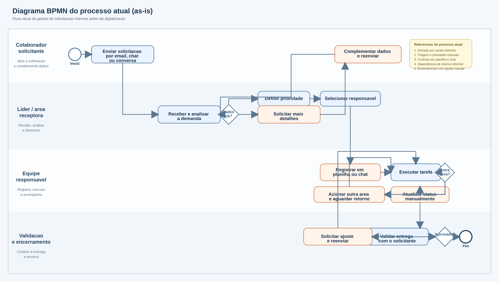
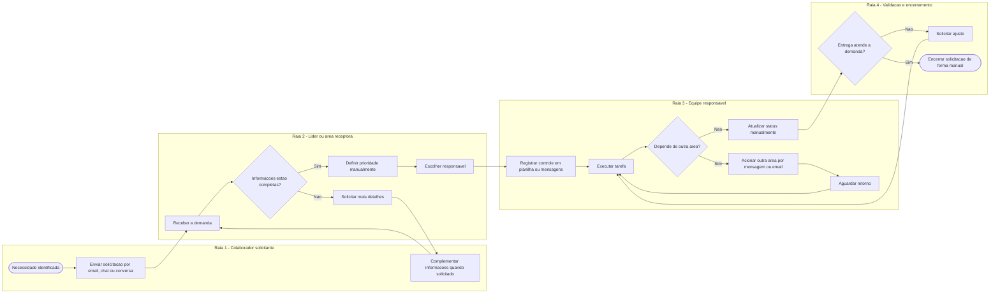

# 10. Modelagem do Processo Atual (As-Is)

Arquivos do diagrama para upload:

- `docs/bpmn-processo-atual.svg` - arquivo fonte limpo e reorganizado
- `docs/bpmn-processo-atual.png` - versao principal para documentacao
- `docs/bpmn-processo-atual-final-2.png` - exportacao pronta para envio
- `docs/bpmn-processo-atual-legivel.png` - exportacao limpa para o site

Preview do diagrama:

## Visao da etapa

Nesta etapa, o foco esta na representacao do processo atual da organizacao antes da implantacao da solucao digital proposta. O objetivo e tornar visivel como as solicitacoes internas interdepartamentais circulam hoje, quais atores participam do fluxo, onde surgem atrasos, retrabalho e perda de contexto, e quais impactos operacionais essas falhas produzem. A modelagem do processo atual e importante porque transforma a percepcao do problema em um artefato analitico capaz de justificar tecnicamente a necessidade do sistema.

## Diagrama BPMN do processo atual

**Observacao:** como a documentacao do projeto ja utiliza `Mermaid`, o diagrama abaixo representa o fluxo `as-is` em estrutura equivalente a BPMN, com raias por ator e pontos de decisao.

## Descricao estruturada do fluxo atual

O processo atual comeca quando um colaborador identifica uma necessidade interna e aciona outra area da empresa para obter atendimento. Essa abertura normalmente acontece por meios informais, como email, chat ou conversa direta. Em seguida, a area receptora analisa a demanda de forma manual para entender o que foi pedido, verificar se as informacoes estao completas, definir a prioridade e indicar quem ficara responsavel pela execucao. Quando faltam dados, o solicitante precisa complementar o pedido, o que gera retorno para etapas anteriores do fluxo.

Depois da triagem, a equipe responsavel registra a demanda em controles paralelos, como planilhas ou mensagens, e inicia a execucao. Caso a atividade dependa de outra area, sao feitos novos contatos informais para obter retorno, aprovacao ou insumos. Enquanto isso, o andamento da solicitacao costuma ser atualizado manualmente e sem historico centralizado. Ao final, a entrega e validada de forma pouco padronizada, podendo gerar ajustes adicionais ou encerramento manual da demanda.

## Gargalos, falhas e redundancias identificados

### 1. Abertura de solicitacoes por canais diferentes

- o mesmo tipo de demanda pode chegar por email, chat ou conversa verbal
- nao existe padronizacao obrigatoria dos dados de entrada
- isso aumenta risco de informacoes incompletas e dificulta o rastreamento

### 2. Triagem manual e pouco padronizada

- a prioridade e definida sem criterio unico visivel
- a distribuicao para responsaveis depende da interpretacao do lider
- isso gera variacao de tratamento entre demandas semelhantes

### 3. Controles paralelos e descentralizados

- parte do fluxo fica em planilhas
- parte fica em mensagens
- parte permanece apenas no conhecimento das pessoas envolvidas
- isso cria redundancia de registros e perda de consistencia

### 4. Dependencia de comunicacao informal entre areas

- bloqueios e dependencias sao resolvidos por cobrancas manuais
- nao existe historico unico dos alinhamentos realizados
- isso amplia o tempo de resposta e dificulta a identificacao de gargalos

### 5. Atualizacao manual do andamento

- o status das demandas nem sempre e atualizado no momento correto
- algumas solicitacoes continuam abertas mesmo ja resolvidas
- outras podem ser encerradas sem registro claro do que foi feito

### 6. Encerramento sem criterio uniforme

- a validacao final depende mais do costume da equipe do que de regra definida
- isso compromete a confiabilidade do processo e a transparencia da entrega

## Avaliacao do impacto operacional

As ineficiencias identificadas provocam impactos diretos na rotina organizacional. O primeiro impacto e o **retrabalho**, pois informacoes precisam ser reenviadas, confirmadas ou reorganizadas varias vezes ao longo do fluxo. O segundo impacto e o **atraso nas entregas**, uma vez que dependencias entre areas nao ficam visiveis com rapidez e as demandas podem permanecer paradas aguardando retorno informal. O terceiro impacto e o **aumento de custos operacionais**, porque as equipes gastam tempo com cobrancas, alinhamentos e correcoes que poderiam ser evitados com um processo mais estruturado.

Tambem ha impacto na **rastreabilidade**, ja que a organizacao nao possui um historico unico para saber quem abriu a demanda, quem executou cada etapa, quais bloqueios ocorreram e quando a solicitacao foi efetivamente concluida. Isso reduz a capacidade gerencial de identificar gargalos, priorizar melhorias e tomar decisoes com base em dados confiaveis. Em termos praticos, a empresa passa a operar de forma reativa, corrigindo falhas depois que elas ja afetaram prazos, produtividade e qualidade do atendimento interno.

## Relacao da modelagem com a futura solucao

A representacao do processo atual evidencia que o problema principal nao esta apenas na execucao das tarefas, mas na falta de integracao entre abertura, triagem, acompanhamento, comunicacao e encerramento das solicitacoes. Essa modelagem `as-is` serve como fundamento para a solucao proposta pelo projeto **IntegraFlow**, que busca centralizar o fluxo em um ambiente unico, reduzir retrabalho, dar visibilidade aos bloqueios e aumentar a rastreabilidade das operacoes.
